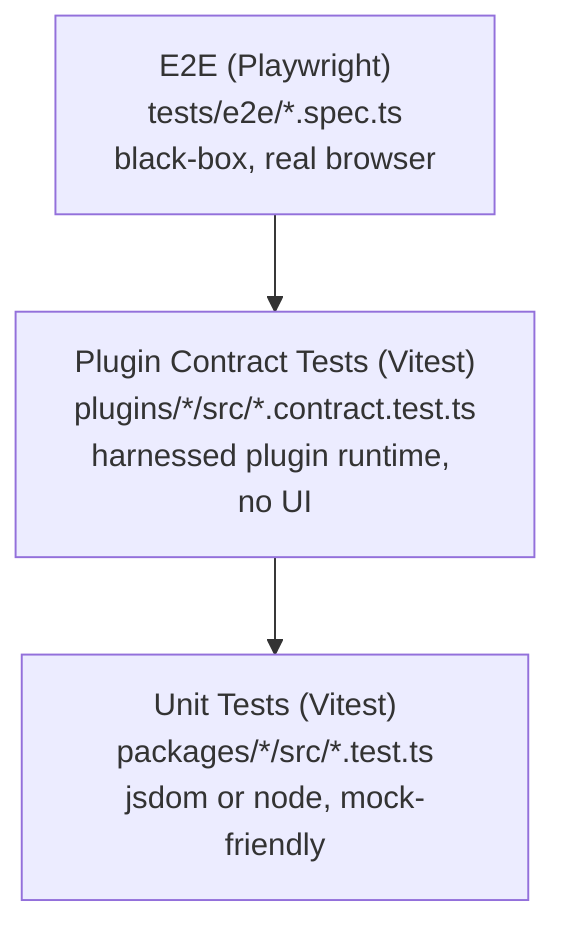
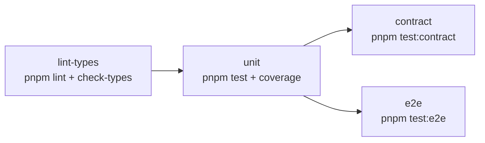

# Testing

**Status:** Canonical. This is the only document that describes the testing strategy.
**Last Updated:** 2026-04-29

This document explains the three test layers, how to add a test of each kind, what runs in CI, and the deferred work that the current MVP does not yet cover.

## Test pyramid



We run **many unit tests, several contract tests per plugin, and a handful of end-to-end specs** — the classic pyramid. CI fails fast on the bottom and only escalates upward when the lower layers are green.

## Unit tests (Vitest)

The default. Anything that is not a plugin contract or a real-browser flow should land here.

- Live next to the code: `packages/<name>/src/foo.test.ts`, `plugins/<name>/src/foo.test.ts`.
- Run via `pnpm test` (per-package, fan-out through Turbo).
- Default environment is `jsdom` — see the root [vitest.config.ts](../vitest.config.ts).
- Coverage runs via `pnpm test:coverage` and uploads to Codecov in CI. **No coverage thresholds are enforced today** — see follow-up #3.

## Contract tests

The contract layer asserts that a plugin honours the public contracts from [docs/architecture/CONTRACTS.md](architecture/CONTRACTS.md) — Runtime API 1.0 and Manifest 1.1. Each plugin gets exactly **one** contract test file, conventionally named `plugin.contract.test.ts`.

### What it checks

The harness lives in [@workspace/plugin-testing](../packages/plugin-testing/README.md). It boots a minimal `PluginManager`, registers the built-in plugins (`objectRegistry`, `renderer`, `appRegistry`), loads the plugin under test, and exposes a small handle:

| Assertion | What it proves |
|---|---|
| `expectActivated()` | The plugin appears in the manager's registry after `initialize()` and `activate()` ran without throwing. |
| `expectAllManifestRegistrationsSucceed()` | Every entry in `plugin.json`'s `extensionPoints` has at least one registered object after activation. Drift is caught at the manifest level. |
| `expectRegistered([...ids])` | Same idea but with an explicit list — useful if a plugin has no manifest declaration yet. |
| `expectI18nKeyParity(locales?)` | All locales declared in `i18nNamespaces` have the same set of translation keys. |
| `expectCleanRender(componentId?)` | Activation (and optionally rendering a registered component) produces zero `console.error` and `console.warn` calls. |

### Reference template

[plugins/core-episodes/src/plugin.contract.test.ts](../plugins/core-episodes/src/plugin.contract.test.ts) is the canonical pattern. Copy it into a new plugin and adjust the import:

```ts
import { resolve } from "node:path";
import { fileURLToPath } from "node:url";
import { afterAll, beforeAll, describe, it } from "vitest";
import {
  loadPluginInHarness,
  readPluginManifest,
  type TestHarness,
} from "@workspace/plugin-testing";

import { myPlugin } from "./index";

const pluginDir = resolve(fileURLToPath(import.meta.url), "..", "..");

describe("my-plugin contract", () => {
  let harness: TestHarness;

  beforeAll(async () => {
    harness = await loadPluginInHarness(myPlugin, {
      manifest: await readPluginManifest(pluginDir),
      pluginDir,
    });
  });

  afterAll(() => harness.dispose());

  it("activates cleanly", () => harness.expectActivated());
  it("populates every extension point declared in plugin.json", () =>
    harness.expectAllManifestRegistrationsSucceed());
  it("does not log errors or warnings during activation", () =>
    harness.expectCleanRender());
  it("has i18n key parity across shipped locales", () =>
    harness.expectI18nKeyParity());
});
```

### Manifest-driven vs. test-declared

Two ways to tell the harness which extension points a plugin must populate:

- **Manifest-driven (preferred).** Add an `extensionPoints` array to `plugin.json` and call `expectAllManifestRegistrationsSucceed()`. The manifest stays the single source of truth for tooling (marketplace listings, generated docs, this test). When the plugin gains or loses an extension point, you only edit the manifest.
- **Test-declared.** Pass an explicit array to `expectRegistered([...])`. Acceptable while a plugin's manifest hasn't been updated to Manifest 1.1, but converge to manifest-driven as soon as practical.

### Adding a contract test to a plugin

1. Add `@workspace/plugin-testing` to the plugin's `devDependencies` (`workspace:*`).
2. Add a `test:contract` script: `"test:contract": "vitest run plugin.contract"`.
3. Drop the test file next to `index.ts` using the template above.
4. Add `extensionPoints: [...]` to `plugin.json` if you opted for manifest-driven assertions.

The package will be picked up by `pnpm test:contract` automatically.

## End-to-end tests (Playwright)

The single smoke spec at [tests/e2e/smoke.spec.ts](../tests/e2e/smoke.spec.ts) drives a real Chromium against `apps/shell`'s Vite dev server. The repo ships no backend, so the spec stubs the four endpoints the shell touches during boot (config.json, plugins.json, /info/me.json, /graphql) and then asserts the sidebar renders without console errors.

### Run locally

```bash
# one-time per machine
pnpm test:e2e:install

# headless run — Playwright auto-starts the shell on :3000 if not already running
pnpm test:e2e

# interactive UI mode for debugging
pnpm test:e2e:ui
```

### Add an E2E test

Drop a new `*.spec.ts` next to `smoke.spec.ts`. The base URL is `http://127.0.0.1:3000/management-ui/`, so use relative `page.goto("...")` paths or absolute paths starting with `/management-ui/`. If your test exercises a feature that talks to the backend, mirror the route-mocking pattern from [smoke.spec.ts](../tests/e2e/smoke.spec.ts) — one `page.route("**/<endpoint>", ...)` per call site.

## CI layout

The test workflow ([.github/workflows/test.yml](../.github/workflows/test.yml)) splits into four jobs that run in dependency order:



| Job | What fails it |
|---|---|
| `lint-types` | ESLint warning, real TypeScript error (auto-generated shadcn errors are filtered). |
| `unit` | Any `*.test.ts` in any package; Codecov upload is best-effort. |
| `contract` | Any `*.contract.test.ts` in any plugin. |
| `e2e` | Any spec in `tests/e2e/`. The Playwright HTML report is uploaded as an artifact (7-day retention) on failure. |

`unit` is the gate before `contract` and `e2e` so a broken Vitest suite never costs us a Chromium download.

## Follow-ups

The MVP shipped in Phase 4 covers exactly **one** contract test (core-episodes) and **one** smoke E2E. The following work is deferred and tracked here so it doesn't silently fall off the radar:

1. **Contract tests for the remaining plugins** — `core-series`, `core-upload`, `admin-marketplace`, `example`. Each is a copy of [plugins/core-episodes/src/plugin.contract.test.ts](../plugins/core-episodes/src/plugin.contract.test.ts) with a renamed import and a manifest-side `extensionPoints` array.
2. **E2E suites per feature** — the smoke spec is a sanity check, not a real flow. Each domain plugin should grow its own spec: upload-flow, series-flow, episodes-flow, marketplace-activation. Drop them next to `smoke.spec.ts` and reuse the route-mock pattern.
3. **Coverage baseline + gates** — measure today's coverage per package, then enforce thresholds. Master-plan target: **80%** for foundation/integration packages, **60%** for apps. Codecov already accepts uploads from CI; only the gates are missing.
4. **Playground as plugin runner** — [apps/playground](../apps/playground) is a static placeholder today. Phase 4 of the master plan calls for a `?plugin=<id>` query-driven runner that loads any single plugin in isolation, enabling per-plugin visual debugging and reusable E2E fixtures.
5. **Marketplace metadata cleanup** — [plugins/admin-marketplace/src/services/plugin-metadata.ts](../plugins/admin-marketplace/src/services/plugin-metadata.ts) currently hard-codes which extension points each plugin advertises. Once every core plugin declares `extensionPoints` in its manifest, the marketplace can read straight from the manifest and the hard-coded map disappears.
6. **Visual regression** — Playwright screenshot diffs across the default theme + at least one alternate theme, gated behind a separate job because of flake risk. Listed as Phase 4b in the master plan.
7. **Remote turbo cache** — the four CI jobs each rebuild the workspace today. Enabling Turbo Remote Cache would let `unit`, `contract`, and `e2e` share artefacts from `lint-types`, cutting overall pipeline time substantially.

When you tackle one of these, delete the entry from this list and reference the resulting commit in the deletion's commit body.

## See also

- [docs/architecture/CONTRACTS.md](architecture/CONTRACTS.md) — the public contracts the harness verifies.
- [packages/plugin-testing/README.md](../packages/plugin-testing/README.md) — full harness API reference.
- [tests/e2e/README.md](../tests/e2e/README.md) — quick how-to-run for the Playwright suite.
