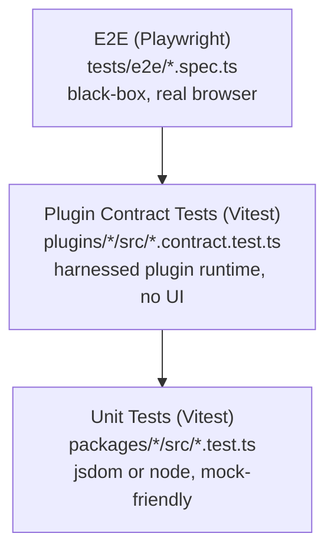
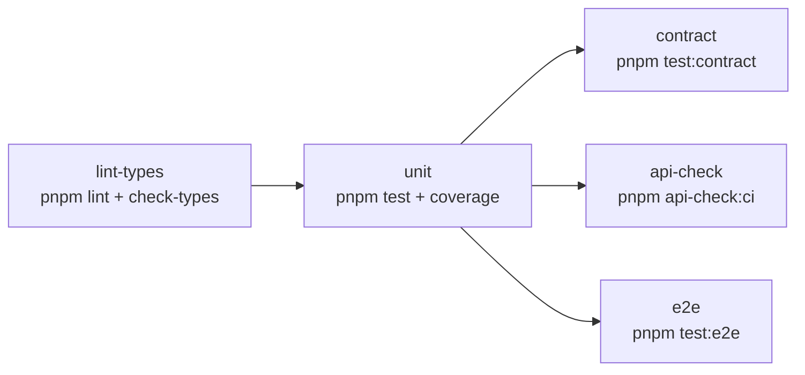

# Testing

For contributors to this repo. Afterwards you'll know which test tier covers what and how to run each one.

**Status:** Canonical. This is the only document that describes the testing strategy.
**Last Updated:** 2026-08-12

This document explains the three test layers, how to add a test of each kind, what runs in CI, and the deferred work that the current MVP does not yet cover.

## Test pyramid



We run **many unit tests, several contract tests per plugin, and a handful of end-to-end specs** — the classic pyramid. CI fails fast on the bottom and only escalates upward when the lower layers are green.

## Unit tests (Vitest)

The default. Anything that is not a plugin contract or a real-browser flow should land here.

- Live next to the code: `packages/<name>/src/foo.test.ts`, `plugins/<name>/src/foo.test.ts`.
- Run via `pnpm test` (per-package, fan-out through Turbo).
- Default environment is `jsdom` — see the root [vitest.config.ts](../../vitest.config.ts).
- Coverage runs via `pnpm test:coverage` and uploads to Codecov in CI. Seven packages (`utils`, `plugin-system`, `store`, `router`, `query`, `i18n`, `ui`) enforce **no-regression coverage thresholds** in their `vitest.config.ts` — floors set a few points below current coverage, so a real drop fails `pnpm test:coverage`. The apps have no gates yet — see follow-up #2.

## Contract tests

The contract layer asserts that a plugin honours the public contracts from [docs/reference/contracts.md](../reference/contracts.md) — chiefly the plugin manifest and the plugin runtime API (that page owns the contract names and version numbers). Each plugin gets exactly **one** contract test file, conventionally named `plugin.contract.test.ts`.

### What it checks

The harness lives in [@oc-mui/plugin-testing](../../packages/plugin-testing/README.md). It boots a minimal `PluginManager`, registers the built-in plugins (`objectRegistry`, `renderer`, `appRegistry`), loads the plugin under test, and exposes a small handle:

| Assertion | What it proves |
|---|---|
| `expectActivated()` | The plugin appears in the manager's registry after `initialize()` and `activate()` ran without throwing. |
| `expectAllManifestRegistrationsSucceed()` | Every entry in `plugin.json`'s `extensionPoints` has at least one registered object after activation. Drift is caught at the manifest level. |
| `expectRegistered([...ids])` | Same idea but with an explicit list — useful if a plugin has no manifest declaration yet. |
| `expectI18nKeyParity(locales?)` | All locales declared in `i18nNamespaces` have the same set of translation keys. |
| `expectCleanRender(opts?)` | Activation (and optionally rendering an element passed via `opts.render`) produces zero `console.error` and `console.warn` calls. See `ExpectCleanRenderOptions` in the [harness API reference](../../packages/plugin-testing/README.md). |

### Reference template

[plugins/core-episodes/src/plugin.contract.test.ts](../../plugins/core-episodes/src/plugin.contract.test.ts) is the canonical pattern. Copy it into a new plugin and adjust the import:

```ts
import { resolve } from "node:path";
import { fileURLToPath } from "node:url";
import { afterAll, beforeAll, describe, it } from "vitest";
import {
  loadPluginInHarness,
  readPluginManifest,
  type TestHarness,
} from "@oc-mui/plugin-testing";

import { myPlugin } from "./index";

const pluginDir = resolve(fileURLToPath(import.meta.url), "..", "..");

describe("my-plugin contract", () => {
  let harness: TestHarness;

  beforeAll(async () => {
    harness = await loadPluginInHarness(myPlugin, {
      manifest: await readPluginManifest(pluginDir),
      pluginDir,
    });
  });

  afterAll(() => harness.dispose());

  it("activates cleanly", () => harness.expectActivated());
  it("populates every extension point declared in plugin.json", () =>
    harness.expectAllManifestRegistrationsSucceed());
  it("does not log errors or warnings during activation", () =>
    harness.expectCleanRender());
  it("has i18n key parity across shipped locales", () =>
    harness.expectI18nKeyParity());
});
```

### Manifest-driven vs. test-declared

Two ways to tell the harness which extension points a plugin must populate:

- **Manifest-driven (preferred).** Add an `extensionPoints` array to `plugin.json` and call `expectAllManifestRegistrationsSucceed()`. The manifest stays the single source of truth for tooling (marketplace listings, generated docs, this test). When the plugin gains or loses an extension point, you only edit the manifest.
- **Test-declared.** Pass an explicit array to `expectRegistered([...])`. Acceptable while a plugin's manifest hasn't been updated to the current manifest schema, but converge to manifest-driven as soon as practical.

### Adding a contract test to a plugin

1. Add `@oc-mui/plugin-testing` to the plugin's `devDependencies` (`workspace:*`).
2. Add a `test:contract` script: `"test:contract": "vitest run plugin.contract"`.
3. Drop the test file next to `index.ts` using the template above.
4. Add `extensionPoints: [...]` to `plugin.json` if you opted for manifest-driven assertions.

The package will be picked up by `pnpm test:contract` automatically.

### `localStorage` in the contract harness

Node 25+ exposes a global `localStorage` placeholder (intended for use with `--localstorage-file`) that surfaces as `{}` and shadows jsdom's working `Storage`. Any contract test running under jsdom that touches `localStorage` would otherwise blow up with `localStorage.removeItem is not a function`. The shared [vitest.setup.ts](../../vitest.setup.ts) installs an in-memory `Storage` shim on `globalThis` and clears it after each test — no per-plugin work needed.

## End-to-end tests (Playwright)

The specs under [tests/e2e/](../../tests/e2e/README.md) drive a real Chromium against `apps/shell` — black-box, mocked backend. The repo ships no backend, so every spec stubs what the shell touches over the network: the boot endpoints (`config.json`, `plugins.json`, `/info/me.json`, `/graphql`) plus the landing page's external calls (GitHub release check, Gravatar).

The suite has grown well beyond the original smoke check. [smoke.spec.ts](../../tests/e2e/smoke.spec.ts) is still the boot sanity check, but most specs are feature flows; the protocol-driven ones (series, episodes, upload, navigation) run against a stateful in-memory GraphQL mock and carry `[XXX-NN]` protocol-step markers in their titles so [`pnpm protocol:coverage`](../../tests/protocol/README.md) can reconcile them against an org's manual protocol. The two mock layers — one-liner boot stubs vs. the stateful mock — are documented in [tests/e2e/README.md](../../tests/e2e/README.md).

### Local vs. CI: the web server differs

Locally, Playwright reuses (or starts) the shell's Vite **dev server** on `:3000`, so the iterate loop keeps HMR and needs no build. In CI the same suite runs against **`vite preview` serving the production build** (the E2E job builds the SDK and shell first) — it exercises what actually ships and avoids the dev server's cold-start timeouts on small runners. The switch lives in [playwright.config.ts](../../playwright.config.ts)'s `webServer`. Consequence: a bug that only exists in the production build (a missing static-copy target, a stale alias) can fail in CI while passing locally — reproduce with `pnpm --filter shell preview`.

### Run locally

```bash
# one-time per machine
pnpm test:e2e:install

# headless run — Playwright auto-starts the shell on :3000 if not already running
pnpm test:e2e

# interactive UI mode for debugging
pnpm test:e2e:ui
```

### Add an E2E test

Drop a new `*.spec.ts` next to `smoke.spec.ts`. The base URL is `http://127.0.0.1:3000/management-ui/`, so use relative `page.goto("...")` paths or absolute paths starting with `/management-ui/`. If your test only needs the shell booted, use the shared boot stubs (`stubShellBoot` from `tests/e2e/_mock-backend.ts`); if it exercises data flows (tables, mutations), build on the stateful mock in `tests/e2e/_fixtures/mock-backend.ts` — see [tests/e2e/README.md](../../tests/e2e/README.md) for when to use which.

## The two hand-fed tiers

Every tier above runs against something we control: the default config, a
scaffolded plugin, a vanilla podman Opencast. A **real deployment** — an org's
`config.json`, its JAR-deployed plugin, its theme, its data shapes — is
covered by two further tiers, both gated on an input a developer can't produce
alone. They skip silently when unfed, so they're safe to run anywhere.

| Tier | Command | Input | Covers |
|---|---|---|---|
| [HAR replay](../../tests/har-replay/README.md) | `pnpm test:har-replay` | A tester's sanitized recording in `tests/har-replay/recordings/` | Boots the shell against the recorded backend; asserts every recorded GraphQL exchange is `Mui`-named and error-free. |
| [Org plugin](../../tests/org-plugin/README.md) | `ORG_PLUGIN=<name> pnpm test:org-plugin` | A plugin in `.local-plugins/<name>/` | Manifest ↔ bundles, i18n namespace discovery + key parity, theme rules, boot-with-plugin, plus visual baselines. |

The org-plugin tier exists because `.local-plugins/` is excluded from every
other gate: it's gitignored, and `pnpm verify` runs with
`--filter='!./.local-plugins/*'`. Without this tier, the org-specific surface —
the part a manual tester actually looks at — has no automated coverage at all.

Recordings and org baselines are gitignored: the machinery is shared, the
org-specific data stays with the org. The tester-facing workflow for producing
them is [`manual-test-recording.md`](./manual-test-recording.md).

### The browser matrix

A manual protocol usually has one result column per browser and device, and a
human walks every step in each of them. Those columns are a Playwright
`projects` array:

```bash
pnpm test:matrix:install   # one-time: chromium + firefox + webkit
pnpm test:matrix           # every tests/e2e/ spec across all five projects
```

[`playwright.matrix.config.ts`](../../playwright.matrix.config.ts) maps
chromium / firefox / webkit / Android tablet / iOS tablet onto the protocol's
columns. `pnpm test:e2e` stays single-browser so `pnpm verify` remains a fast
pre-push gate; the matrix runs in CI on merge into `develop` or an `r/NN.x` line
([`matrix.yml`](../../.github/workflows/matrix.yml)) and on demand before a
release. CI skips the chromium project there — the PR gate already covers it.

Two honest limits, both documented in the config: Playwright cannot emulate
Firefox on Android, and emulation is not a real device — the input-stack defects
the protocol actually found on tablets (search losing focus after a few
keystrokes, hover-only tooltips) do not reproduce in an emulator. Those rows
stay manual.

### Measuring the shrink

An org's manual protocol usually lives in a wiki, with no ids on its rows — so
nobody can say which rows are already automated, and the list only grows.
[`tests/protocol/`](../../tests/protocol/README.md) fixes that:

```bash
pnpm protocol:import <exported.json> -o tests/protocol/<org>.yaml
pnpm protocol:coverage tests/protocol/<org>.yaml
```

The import assigns a permanent id per step; a test claims one by putting it in
its title (`test("[SER-04] …")`), and the coverage report says how many steps
are still hand-run. It also sorts the backlog by steps that have already failed
at least once — which is the order worth automating in.

## Documentation screenshots — generated, not maintained

The images in the documentation are produced by the same machinery, so they
cannot drift into showing a UI that no longer exists:

```bash
pnpm docs:screenshots     # rewrites docs/public/screenshots/*.png
```

[`playwright.docs.config.ts`](../../playwright.docs.config.ts) boots a clean
mocked-backend dev server (1280×800, reduced motion — the visual tier's
settings) and [`tests/docs-screenshots/capture.spec.ts`](../../tests/docs-screenshots/capture.spec.ts)
drives it through the documented screens, seeding a small English demo corpus
through the stateful mock in `tests/e2e/_fixtures/mock-backend.ts`. The PNGs are
committed and the pages embed them as `/screenshots/<name>.png`, which VitePress
serves from `docs/public/`.

Unlike the visual tier, these captures are **never diffed** — they are
artefacts, not assertions — so nothing here is sensitive to the font rendering
of the machine that produced them, and the tier is deliberately not part of
`pnpm verify`. Re-run it when a UI change makes a shipped image wrong, and
commit the result.

## CI layout

The test workflow ([.github/workflows/test.yml](../../.github/workflows/test.yml)) splits into five jobs that run in dependency order:



| Job | What fails it |
|---|---|
| `lint-types` | ESLint warning, any TypeScript error. |
| `unit` | Any `*.test.ts` in any package; Codecov upload is best-effort. |
| `contract` | Any `*.contract.test.ts` in any plugin. |
| `api-check` | Drift between a package's committed `etc/<pkg>.api.md` snapshot and the report API Extractor regenerates — see [`release.md` → API surface drift detection](./release.md#api-surface-drift-detection). |
| `e2e` | Any spec in `tests/e2e/`, run against the production build (`vite preview` — see above). The Playwright HTML report is uploaded as an artifact (7-day retention) on failure. |

`unit` is the gate before `contract`, `api-check` and `e2e` so a broken Vitest suite never costs us a Chromium download.

## Before pushing

Run the same chain locally to find failures before review:

```bash
pnpm verify
```

This is the canonical pre-push gate — the step list and the `.local-plugins` exclusion are documented once in [AGENTS.md → Pre-push gate](../../AGENTS.md#pre-push-gate--pnpm-verify). Run `pnpm test:e2e:install` once on a new machine to download Chromium.

Including `build` in the chain is intentional: `vite dev` warns where `vite build` errors out, so a missing static-copy target or a stale alias only surfaces in production builds. `pnpm verify` catches that class of bug locally.

## Follow-ups

Every plugin now ships a `plugin.contract.test.ts`, and on top of the mocked E2E suite there is a real-backend [integration tier](../../tests/integration/README.md) and a [visual-regression tier](../../tests/visual/README.md). The following work is still deferred and tracked here so it doesn't silently fall off the radar:

1. **E2E suites per feature (mocked) — residue only** — largely done: the protocol-driven specs (series, episodes, upload, navigation) are real per-feature flows against the stateful mock, and marketplace activation has its own tier (`pnpm test:marketplace`). What remains is converting the residual hand-run protocol steps; `pnpm protocol:coverage` sorts that backlog (steps that have already failed at least once come first).
2. **Coverage gates — extend to the apps** — seven packages (`utils`, `plugin-system`, `store`, `router`, `query`, `i18n`, `ui`) now enforce no-regression thresholds in their `vitest.config.ts` (floors set a few points below current coverage, so a real drop fails `pnpm test:coverage`). The apps have no coverage gates yet; extend the same ratchet there, working toward the master-plan target of **60%** for apps. Codecov already ingests uploads from CI.
3. **Playground as plugin runner** — [apps/playground](../../apps/playground) is a static placeholder today. Phase 4 of the master plan calls for a `?plugin=<id>` query-driven runner that loads any single plugin in isolation, enabling per-plugin visual debugging and reusable E2E fixtures.
4. **Visual regression — data screens + promote to CI** — the [visual tier](../../tests/visual/README.md) (`pnpm test:visual`) snapshots the shell landing in light + dark, in both the default theme and an alternate showcase theme (oxford-navy) — those baselines are committed. Remaining: extend it to the key data screens (episodes/series tables), and promote it from an opt-in command to a CI job rendered in a fixed container for byte-stable baselines.
5. **Remote turbo cache** — the CI jobs each rebuild the workspace today. Enabling Turbo Remote Cache would let `unit`, `contract`, `api-check` and `e2e` share artefacts from `lint-types`, cutting overall pipeline time substantially.

When you tackle one of these, delete the entry from this list and reference the resulting commit in the deletion's commit body.

## Every manual run feeds automation

When a release-protocol run finds a bug, the bug is telling you which automated test was missing. Convert it, don't just fix it:

- **Pure logic bug** (formatter, sort field, config parse) → write a failing **unit test**, then fix.
- **Plugin not registering / manifest drift / console error on load** → strengthen that plugin's `plugin.contract.test.ts`.
- **Broken user flow** → add an **E2E spec** (the `EventOrderByInput` sort regression is the canonical example of something that should be a permanent E2E test).
- **Only-a-real-backend bug** → add/refine an **integration-E2E** spec in [`tests/integration/`](../../tests/integration/) and/or a row in [`test-protocol.md`](./test-protocol.md).

The rule: every protocol run either converts a found bug into a permanent automated test, or adds/refines a checklist row — so the manual protocol shrinks every release instead of being a recurring slog.

Better still, don't wait for a bug: have the tester **record** the run. A
sanitized HAR turns the whole session into a replayable fixture, whether or not
it found anything — see [`manual-test-recording.md`](./manual-test-recording.md)
for the two-clicks-per-section workflow and
[`tests/har-replay/`](../../tests/har-replay/README.md) for what it buys.

## See also

- [docs/reference/contracts.md](../reference/contracts.md) — the public contracts the harness verifies.
- [packages/plugin-testing/README.md](../../packages/plugin-testing/README.md) — full harness API reference.
- [tests/e2e/README.md](../../tests/e2e/README.md) — quick how-to-run for the Playwright suite.
