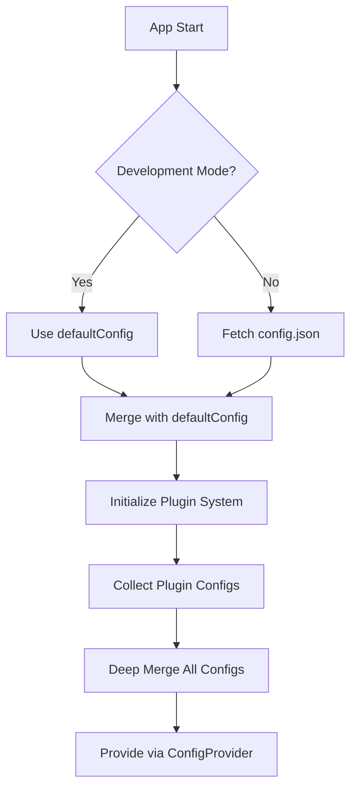

# @workspace/ui-config

This package defines and provides access to UI-related configurations for the video management platform.

It includes:
-   `AppConfig` interface: Defines the shape of the configuration object.
-   `defaultConfig`: Provides sensible default values for the application with generic, customizable themes.
-   `getAppConfig(instanceConfig?: Partial<AppConfig>): AppConfig`: A function to retrieve the configuration, allowing for instance-specific overrides to be merged with the defaults.
-   `ConfigProvider`: React context provider for application configuration.
-   `useAppConfig`: React hook to access configuration within components.

## Usage

### Development Mode

In development, the system uses the `defaultConfig` plus any plugin-provided configurations for hot reloading:

```typescript
import { defaultConfig, getAppConfig } from '@workspace/ui-config';

// Development mode automatically merges defaultConfig with plugin configurations
// Supports hot reloading when changes are made to plugin configurations
const config = getAppConfig(); // Uses defaultConfig + plugin configs
```

### Production Mode

Applications or modules can import configuration utilities to access the current configuration:

```typescript
import { getAppConfig, AppConfig } from '@workspace/ui-config';

// Get the default config merged with any potential instance-specific values
const config: AppConfig = getAppConfig(); 

console.log(config.app.appName);

// If you have instance-specific values, e.g., from an environment variable or a specific setup file:
const instanceSpecificValues = {
  app: {
    appName: 'My Custom Video Hub',
    theme: 'customTheme',
    logoUrl: '/custom-logo.png',
  },
};
const customConfig = getAppConfig(instanceSpecificValues);
console.log(customConfig.app.appName);
```

## Configuration Structure

The configuration includes:
- **app**: Application metadata, branding, theming, and plugin configuration
- **auth**: Authentication URLs and settings  
- **plugins**: Plugin-specific configurations
- **api**: API endpoints and settings
- **features**: Feature flags and toggles
- **timeouts**: Request and session timeout settings

## Plugin-Based Configuration System

### Overview

The configuration system supports a **plugin-based approach**. This allows universities, environments, or features to provide their own configuration via plugins, rather than modifying a central config file. This approach brings the same flexibility and separation of concerns as the UI plugin system.

### Why Plugin-Based Config?

- **Separation of Concerns:** University- or environment-specific config lives in its own plugin, not in the global config.
- **Composability:** Multiple config sources can be merged at runtime.
- **Extensibility:** New config keys can be added by any plugin, without changing core code.
- **Dynamic Loading:** Config can be loaded, merged, and overridden at runtime, just like plugins.

### How It Works

#### 1. Register Config Objects via Plugins

Each plugin can register a config object using the object registry, with a well-known type (e.g., `app:config`).

**Example: University-specific config plugin**
```ts
// plugins/university/implementations/config.ts
import { createPlugin } from '@workspace/plugin-system';

export const universityConfigPlugin = createPlugin({
  namespace: 'university',
  type: 'config',
  version: '1.0.0',
  initialize(manager) {
    manager.registerObject('app:config', 'university', {
      app: {
        theme: 'university-theme',
        logoUrl: '/assets/university-logo.png',
      },
      // Add university-specific configurations
    });
  },
  activate() {},
  deactivate() {},
});
```

#### 2. Merging Configs at Runtime

At app startup, all `app:config` objects are collected from the plugin registry and **deep-merged** with the loaded (or fallback) config. Later plugins override earlier ones.

**Example (simplified):**
```ts
import { useRegistry } from '@workspace/plugin-system';

const { items: pluginConfigObjects } = useRegistry('app:config');
const mergedConfig = deepMerge(
  { ...baseConfig },
  ...pluginConfigObjects
);
```

#### 3. Using the Merged Config

The merged config is provided to the app via `ConfigProvider` and is available everywhere as before.

### Development vs Production Configuration

#### Development
- Uses `defaultConfig` merged with plugin-provided configurations
- Enables hot reloading through the plugin system
- No separate config file needed - uses plugin registry
- Supports rapid iteration and testing through plugin overrides

#### Production
- Config generated to `/ui/config/management-ui/config.json`
- Fetched at runtime via HTTP
- Supports dynamic configuration without rebuilding
- Can be customized per environment/deployment

### Migration Guide

1. **Move institution-specific config out of the central config.**
2. **Create a config plugin** for each university, environment, or feature.
3. **Update config loading logic** to merge all registered config objects.
4. **Remove institution-specific keys from the central config.**
5. **Test and document the new pattern.**

### Best Practices

- **Namespace your config keys** to avoid collisions.
- **Use deep merge** to allow partial overrides.
- **Document required config keys** for plugin authors.
- **Keep sensitive config out of plugins** if they are distributed publicly.
- **Use TypeScript for development configs** to enable hot reloading.
- **Use JSON for production configs** to allow runtime customization.

### Example: Consuming a Custom Config Key

```ts
// In an institution-specific component
const { config } = useAppConfig();
const customUrl = config.institutionUrl; // Provided by institution config plugin
```

### Configuration Loading Flow



### FAQ

**Q: What if two plugins provide the same config key?**
- The last plugin loaded wins (later plugins override earlier ones in the merge).

**Q: Can I provide only a section of config?**
- Yes! Plugins can register partial config objects (e.g., just `branding` or `urls`).

**Q: Is this compatible with environment-based config files?**
- Yes. The plugin-based config is merged with the loaded (or fallback) config file.

**Q: How do I enable hot reloading in development?**
- Hot reloading works automatically through the plugin system - changes to plugin configurations are reflected immediately without restart.

**Q: Where should production configs be placed?**
- Production configs are generated to `/ui/config/management-ui/config.json` and served statically.

## References
- See plugin system documentation for object registration patterns.
- See `ConfigProvider.tsx` for how config is provided to the app.
- See `apps/management-ui-core/src/main.tsx` for the merging logic. 