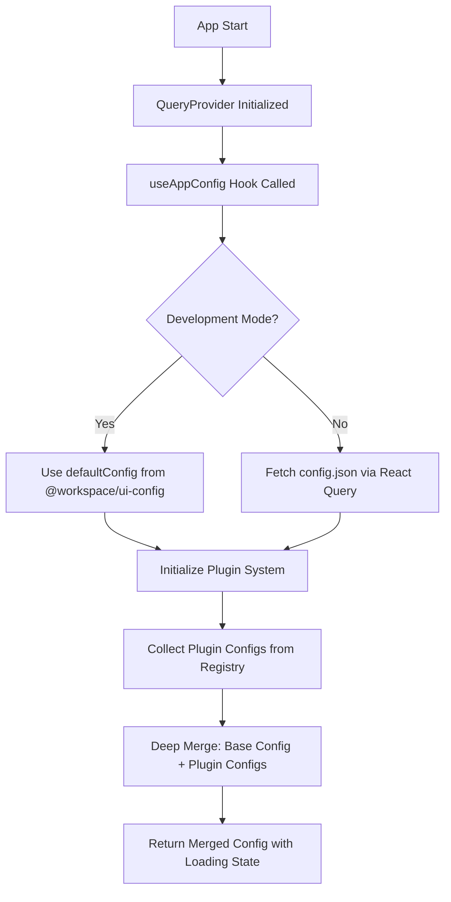

# @workspace/ui-config

This package defines and provides access to UI-related configurations for the video management platform.

**Post-Refactoring Architecture**: Following PR #31, this package works in tandem with `@workspace/query`:

- **`@workspace/ui-config`**: Provides configuration schema, types, and default values
- **`@workspace/query`**: Handles configuration loading, merging, caching, and provides the `useAppConfig` hook

It includes:

- `AppConfig` interface: Defines the shape of the configuration object.
- `defaultConfig`: Provides sensible default values for the application with generic, customizable themes.
- `getAppConfig(instanceConfig?: Partial<AppConfig>): AppConfig`: A legacy function for configuration merging (use `useAppConfig` from `@workspace/query` instead).
- Legacy exports for backward compatibility (migration to `@workspace/query` recommended).

## Usage

### Current Architecture (Post-Refactoring)

**Important**: Following the configuration system refactoring in PR #31, the `useAppConfig` hook has been moved to `@workspace/query`. This package now primarily serves as the configuration schema and utilities provider.

### Development Mode

In development, the `@workspace/query` package handles configuration loading and merging:

```typescript
import { useAppConfig } from "@workspace/query"; // ← NEW LOCATION

// The hook automatically merges defaultConfig with plugin configurations
// Supports hot reloading when changes are made to plugin configurations
const { config, isLoading, isError } = useAppConfig();
```

### Production Mode

Applications should import the hook from the new location:

```typescript
import { useAppConfig } from "@workspace/query"; // ← NEW LOCATION
import type { AppConfig } from "@workspace/ui-config"; // ← Types still available here

// Get the configuration with automatic merging and caching
const { config, isLoading, isError } = useAppConfig();

console.log(config.app.appName);
```

### Legacy Configuration Utilities (Deprecated)

For backward compatibility, configuration utilities are still available, but **not recommended for new code**:

```typescript
import { getAppConfig, AppConfig } from "@workspace/ui-config";

// Legacy approach - use useAppConfig from @workspace/query instead
const config: AppConfig = getAppConfig();

// Legacy instance-specific configuration - handled automatically by useAppConfig now
const instanceSpecificValues = {
  app: {
    appName: "My Custom Video Hub",
    theme: "customTheme",
    logoUrl: "/custom-logo.png",
  },
};
const customConfig = getAppConfig(instanceSpecificValues);
```

## Configuration Structure

The configuration includes:

- **app**: Application metadata, branding, theming, and plugin configuration
- **auth**: Authentication URLs and settings
- **plugins**: Plugin-specific configurations
- **api**: API endpoints and settings
- **features**: Feature flags and toggles
- **timeouts**: Request and session timeout settings

## Plugin-Based Configuration System

### Overview

The configuration system supports a **plugin-based approach**. This allows universities, environments, or features to provide their own configuration via plugins, rather than modifying a central config file. This approach brings the same flexibility and separation of concerns as the UI plugin system.

### Why Plugin-Based Config?

- **Separation of Concerns:** University- or environment-specific config lives in its own plugin, not in the global config.
- **Composability:** Multiple config sources can be merged at runtime.
- **Extensibility:** New config keys can be added by any plugin, without changing core code.
- **Dynamic Loading:** Config can be loaded, merged, and overridden at runtime, just like plugins.

### How It Works

#### 1. Register Config Objects via Plugins

Each plugin can register a config object using the object registry, with a well-known type (e.g., `app:config`).

**Example: University-specific config plugin**

```ts
// plugins/university/implementations/config.ts
import { createPlugin } from "@workspace/plugin-system";

export const universityConfigPlugin = createPlugin({
  namespace: "university",
  type: "config",
  version: "1.0.0",
  initialize(manager) {
    manager.registerObject("app:config", "university", {
      app: {
        theme: "university-theme",
        logoUrl: "/assets/university-logo.png",
      },
      // Add university-specific configurations
    });
  },
  activate() {},
  deactivate() {},
});
```

#### 2. Merging Configs at Runtime

At app startup, all `app:config` objects are collected from the plugin registry and **deep-merged** with the loaded (or fallback) config. Later plugins override earlier ones.

**Example (simplified):**

```ts
import { useRegistry } from "@workspace/plugin-system";

const { items: pluginConfigObjects } = useRegistry("app:config");
const mergedConfig = deepMerge({ ...baseConfig }, ...pluginConfigObjects);
```

#### 3. Using the Merged Config

The merged config is provided to the app via `ConfigProvider` and is available everywhere as before.

### Development vs Production Configuration

#### Development

- Uses `defaultConfig` merged with plugin-provided configurations
- Enables hot reloading through the plugin system
- No separate config file needed - uses plugin registry
- Supports rapid iteration and testing through plugin overrides

#### Production

- Config generated to `/ui/config/management-ui/config.json`
- Fetched at runtime via HTTP
- Supports dynamic configuration without rebuilding
- Can be customized per environment/deployment

### Migration Guide

1. **Move institution-specific config out of the central config.**
2. **Create a config plugin** for each university, environment, or feature.
3. **Update config loading logic** to merge all registered config objects.
4. **Remove institution-specific keys from the central config.**
5. **Test and document the new pattern.**

### Best Practices

- **Namespace your config keys** to avoid collisions.
- **Use deep merge** to allow partial overrides.
- **Document required config keys** for plugin authors.
- **Keep sensitive config out of plugins** if they are distributed publicly.
- **Use TypeScript for development configs** to enable hot reloading.
- **Use JSON for production configs** to allow runtime customization.

### Example: Consuming a Custom Config Key

```ts
// In an institution-specific component
import { useAppConfig } from "@workspace/query"; // ← NEW LOCATION

const { config } = useAppConfig();
const customUrl = config.institutionUrl; // Provided by institution config plugin
```

## Migration Guide

### Breaking Changes in PR #31

The configuration system was refactored to consolidate data management and configuration under `@workspace/query`. Here are the key changes:

#### 1. Import Location Change

**Before:**

```typescript
import { useAppConfig } from "@workspace/ui-config";
```

**After:**

```typescript
import { useAppConfig } from "@workspace/query";
```

#### 2. Simplified App Setup

**Before:**

```typescript
import { ConfigProvider, defaultConfig } from '@workspace/ui-config';

// Manual setup required
<ConfigProvider
  configData={defaultConfig}
  isLoading={false}
  isError={false}
  error={null}
  isFetched={true}
>
  <App />
</ConfigProvider>
```

**After:**

```typescript
import { QueryProvider } from '@workspace/query';

// Configuration handled internally - no ConfigProvider needed
<QueryProvider>
  <App />
</QueryProvider>
```

#### 3. Removed Hooks and Patterns

- ❌ `ConfigProvider` wrapper is no longer needed
- ❌ `useMergedAppConfig` hook has been removed
- ❌ Manual config passing to providers is no longer required

#### 4. Updated Package Responsibilities

- **`@workspace/ui-config`**: Configuration schema, types, and default values
- **`@workspace/query`**: Configuration loading, merging, caching, and the `useAppConfig` hook

### Migration Steps

1. **Update imports** in all files using `useAppConfig`:

   ```typescript
   // Change this:
   import { useAppConfig } from "@workspace/ui-config";

   // To this:
   import { useAppConfig } from "@workspace/query";
   ```

2. **Remove ConfigProvider** wrapper if present:

   ```typescript
   // Remove ConfigProvider wrapper - configuration is handled internally
   // by QueryProvider and useAppConfig hook
   ```

3. **Update component usage** (API remains the same):

   ```typescript
   const { config, isLoading, isError } = useAppConfig(); // Same API
   ```

4. **Keep type imports** from ui-config if needed:
   ```typescript
   import type { AppConfig } from "@workspace/ui-config"; // Types still here
   ```

### Configuration Loading Flow



### FAQ

**Q: What if two plugins provide the same config key?**

- The last plugin loaded wins (later plugins override earlier ones in the merge).

**Q: Can I provide only a section of config?**

- Yes! Plugins can register partial config objects (e.g., just `branding` or `urls`).

**Q: Is this compatible with environment-based config files?**

- Yes. The plugin-based config is merged with the loaded (or fallback) config file.

**Q: How do I enable hot reloading in development?**

- Hot reloading works automatically through the plugin system - changes to plugin configurations are reflected immediately without restart.

**Q: Where should production configs be placed?**

- Production configs are generated to `/ui/config/management-ui/config.json` and served statically.

## References

- See plugin system documentation for object registration patterns.
- Configuration loading and merging logic is now handled in `@workspace/query` package.
- See `useAppConfig` hook implementation in `packages/query/src/hooks/useAppConfig.ts` for current merging logic.
